# 基于Frangi滤波器的食品包装头发检测
该项目为**图像分析基础**课程实践项目，针对食品包装质检中头发异物检测的痛点，将医学影像领域的Frangi血管检测滤波器与传统图像处理技术结合，实现食品包装图像中头发异物的自动化检测，有效解决人工检测效率低、漏检率高的问题，为食品工业自动化质检提供技术参考。

## 项目背景
食品安全是食品工业核心议题，头发是食品包装环节常见且难以检测的异物，具有**形态纤细（直径60~90μm）、颜色多样、易附着**的特点，且食品包装存在反光、印刷图案、褶皱等干扰因素。
传统人工目视检测存在**效率低、漏检率高（14%-20%）、主观性强**的局限，而Frangi滤波器对细长管状结构的特异性识别能力，为头发检测提供了新的技术路径，本项目据此搭建适配食品包装场景的头发检测方案。

## 数据集介绍
实验采用3张工业相机在生产模拟环境下拍摄的食品包装表面图像，核心信息如下：
- 规格：分辨率3276*2400，JPG格式
- 包装特征：蓝色背景、透明塑料薄膜材质，存在反光、彩色印刷图案/文字
- 头发特征：每张含3根及以上3~15cm的黑/深棕色头发，部分弯曲、与食品边缘重叠
- 数据增强：通过旋转、缩放、添加高斯噪声解决样本量少的问题，提升模型鲁棒性
展示如下：

## 核心算法：Frangi血管检测滤波器
Frangi滤波器是基于**Hessian矩阵**的多尺度管状结构增强算法，最初用于医学影像血管/神经检测，其核心是通过分析像素点Hessian矩阵的特征值，判断区域是否为管状结构，对管状结构赋予高权重、背景/其他结构低权重，实现细长结构增强。
### 算法适配性
1. **形态适配**：头发与血管均为细长连续管状结构，设置尺度参数σ∈[0.5,2.0]，可适配直径2~15像素的发丝
2. **抗干扰强**：基于几何特征识别，而非纹理变化，能有效抑制包装印刷、材质纹理干扰，降低误检率
3. **保持连续**：可跨越反光、褶皱导致的发丝断裂区域，减少形态学闭运算迭代次数，提升检测效率

## 图像处理流程
整体流程：`原始图像 → 灰度化 → 高斯滤波去噪 → Frangi滤波增强 → 阈值分割 → Canny边缘增强 → 特征融合 → 形态学操作 → 轮廓筛选 → 头发标注`
### 关键步骤说明
1. **预处理**：灰度化消除颜色干扰、减少计算量；高斯滤波平滑高频噪声，同时保留发丝边缘细节
2. **特征增强**：Frangi滤波多尺度增强发丝管状特征，结合对比度拉伸、幂律变换提升弱响应区域辨识度
3. **边缘检测**：Canny边缘检测通过双阈值机制提取发丝轮廓，抑制伪边缘
4. **特征融合**：通过像素级逻辑或运算融合Frangi管状特征与Canny边缘特征，互补检测结果，降低漏检
5. **形态学操作**：闭运算连接断裂发丝，开运算去除孤立噪声点
6. **轮廓筛选**：基于**轮廓长度、面积、面积周长比**设置几何阈值，过滤非头发轮廓，精准定位目标

## 实验调参
针对核心步骤优化关键参数，适配食品包装头发检测场景，核心参数如下：
1. **Frangi滤波器**：scale_range=(1,3)，beta=0.3，gamma=10
2. **阈值分割**：二值化阈值30（cv2.THRESH_BINARY）
3. **形态学操作**：闭运算3×3核、迭代2次；开运算2×2核、迭代2次
4. **轮廓筛选**：长度>700像素，面积>1000像素²，2.3<面积/长度<3.55

## 实验结果
对3张测试图像完成头发检测，实现细长发丝的精准定位与突出显示，核心检测结果如下：
| 图像 | 检测头发数量 | 核心特征 |
| ---- | ------------ | -------- |
| Img1 | 6            | 面积周长比2.449~3.538 |
| Img2 | 2            | 面积周长比2.604~3.536 |
| Img3 | 2            | 面积周长比2.487~3.181 |

### 加工步骤可视化
下面以样本1为例战术代码中对图像加工的效果
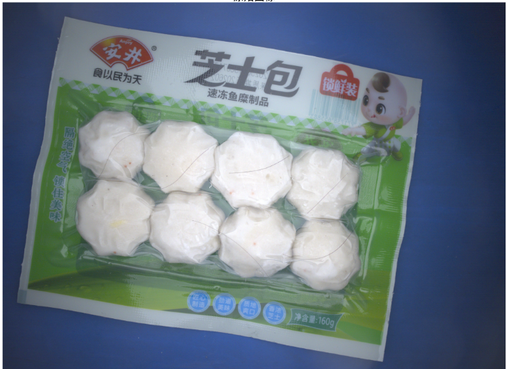
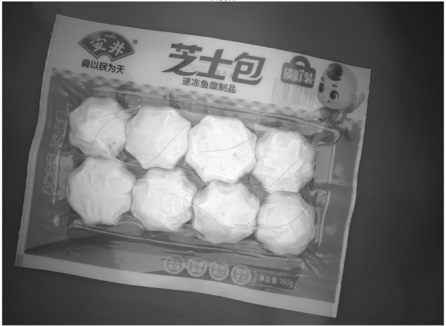
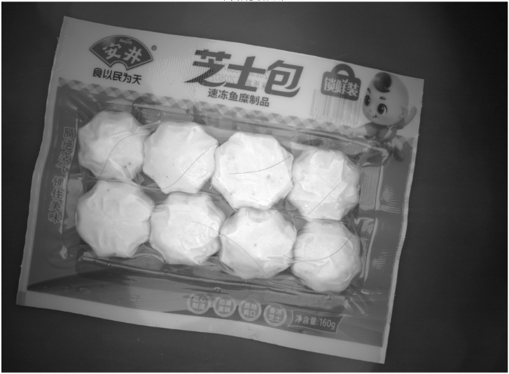
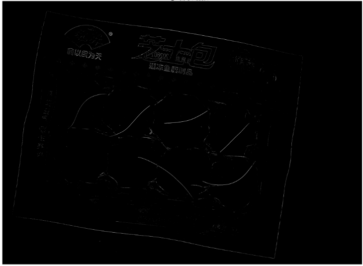
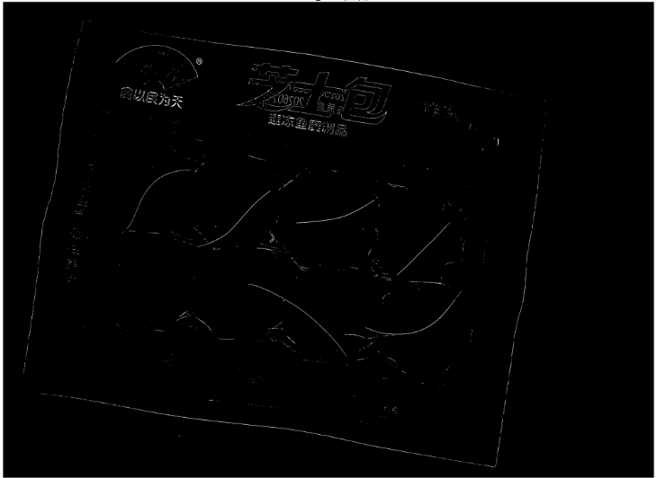
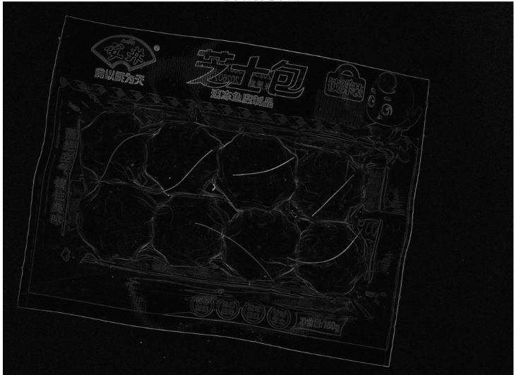
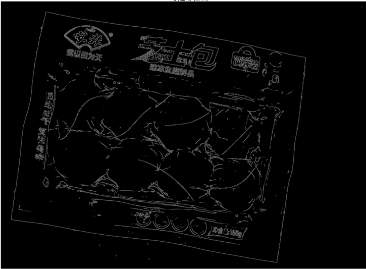
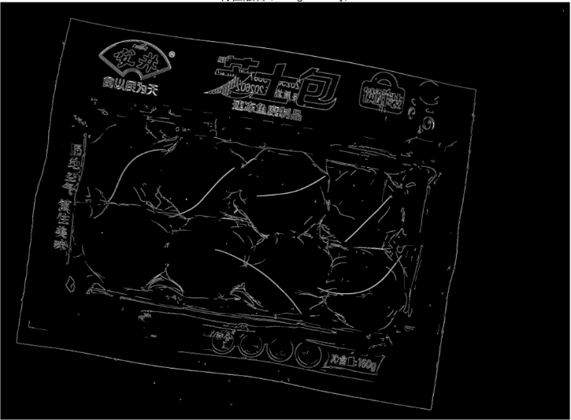
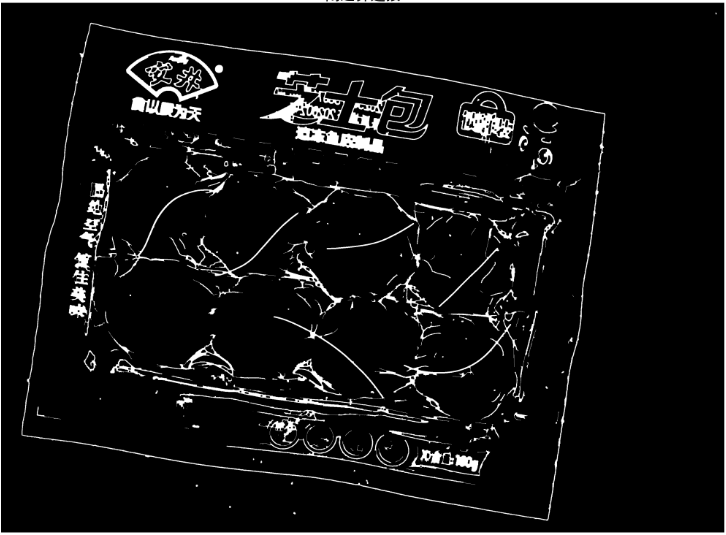
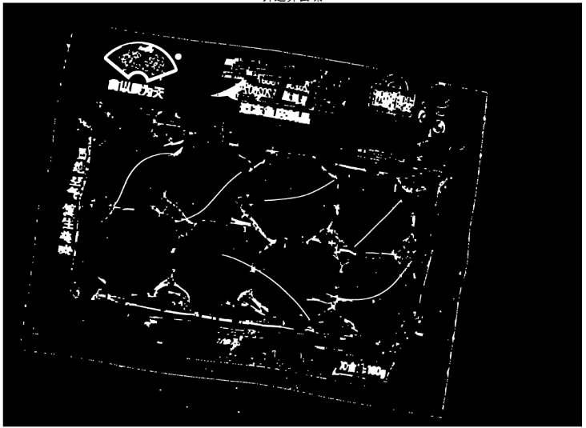
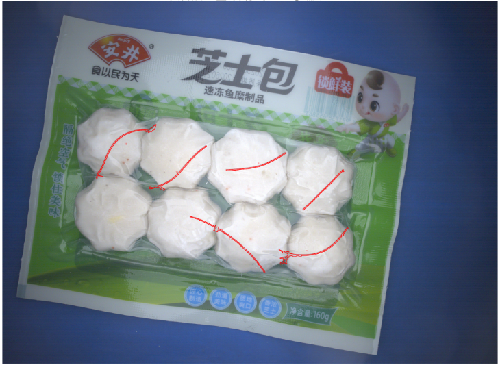

### 结果可视化
<!-- 插入检测结果对比图，示例：原始图像-处理后图像对比 -->
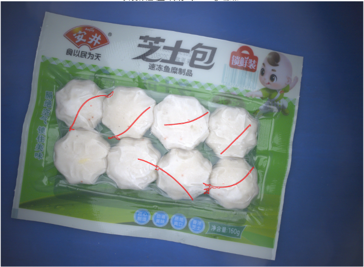
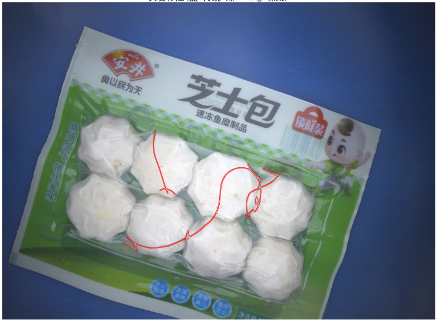
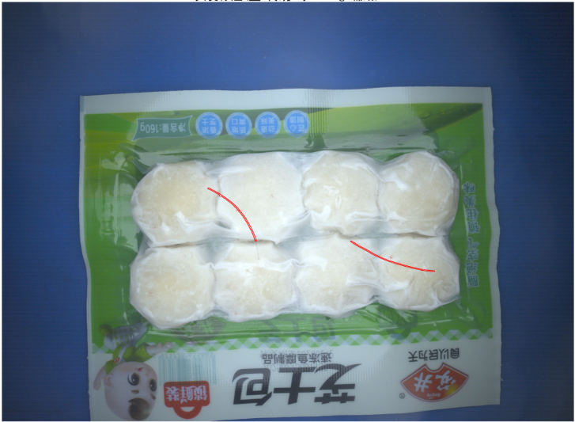

**实验结论**：该方法对细弱、低对比度发丝的检测精度优于传统边缘检测算法，处理流程计算复杂度适中，可在常规硬件稳定运行。

## 项目总结与展望
### 项目亮点
将医学影像的Frangi滤波算法与工业质检的传统图像处理技术结合，构建**多特征融合**的头发检测方案，有效弥补单一检测方法的局限性，提升了食品包装场景下头发检测的准确性与稳定性。

### 现存问题
对**发丝交叉区域、食品包装褶皱处**易出现一定程度误检，样本量较少，泛化能力有待验证。
